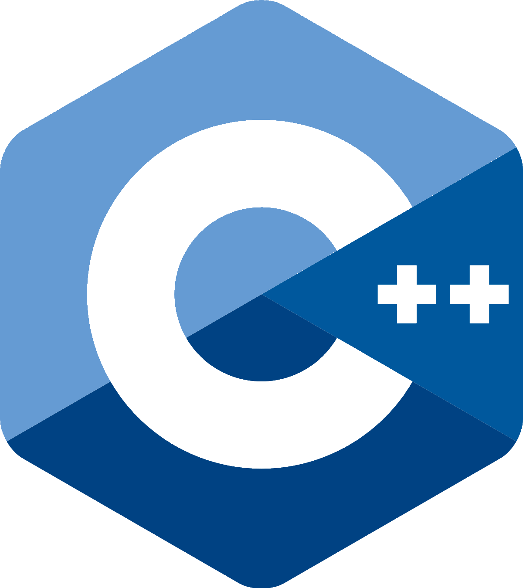

### **EmbeddedProgramming**

`#include <❤>`<br>

<!-- Link Definitions for Wakatime -->
[Wakatime Logo Link]: https://wakatime.com/badge/user/f89598ea-6723-481b-a51b-6323e54a3c5c/project/0645c716-822f-4ba1-a897-04cf5a3fbbfb.svg
[Wakatime Info Link]: https://wakatime.com/badge/user/f89598ea-6723-481b-a51b-6323e54a3c5c/project/0645c716-822f-4ba1-a897-04cf5a3fbbfb?style=flat

[![wakatime][Wakatime Logo Link]][Wakatime Info Link]

This is a repository created dedicated to embedded programming in Linux environment. <br>
Each topic is placed in individual folder. Projects are placed under each descriptively-named folders. <br>

#### **Special Thanks**
**Prof. Charmaine Jirgens** <br>
My mentor to the programming world <br>
Professor, Electronics Engineering and Information Technology <br>
Heritage College, Gatineau, Quebec, Canada

> Software does not run in a magic fairy aether powered by the fevered dreams of CS PhDs.

#### Languages
**C/C++, Objective-C/C++**

   

```C++
class employee {
private:
    std::string name_;
public:
    void set_name(const std::string& name) { name_ = name; }
    void set_name(const std::string&& name) noexcept {
        name_ = std::move(name);
    }
};
```

#### **Getting Started**
**Example to Compile a File Named `Tuple_get_tie.cpp`**

```Bash
$ g++ --version
$ cd ./StandardTemplateLibrary/Tuple
$ g++ -o get_tie.exe Tuple_get_tie.cpp -std=c++11
```

**To Update MinGW on Windows**  
Run a `PowerShell` session with administrator privilege and run:

```Bash
$ # Get the latest version of mingw
$ mingw-get update
$ mingw-get upgrade
$ # Verify the version of installed gcc and g++
$ gcc --version
$ g++ --version
```

---

### **Repository Directories**
**Most** of the directories are provided with a `CMakelists.txt`. <br>
Using `CMake` will be significantly easier than manually compilling all the files with your favourite compiler. <br>

If you already have a configured `CMake` for your operating system, simple change to the directory with such `CMakelists.txt` and run:<br>
```Bash
$ cmake .
```
or
```Bash
$ cmake ./CMakelists.txt
```

For example, change to directory `./DesignPatterns`:
```Bash
$ cd ./DesignPatterns
$ cmake ./CMakelists.txt
```

The convention is to create a folder dedicated to `CMake` files, for example, `build` or `bin`:
```Bash
$ cd ./DesignPatterns
$ mkdir build
$ cd build
$ cmake ..
```


#### Directory `./Util`
Functionality provided by separate module. A namespace `util` is created to better manage the functions.
```C++
namespace util {
    namespace type {}
    namespace parse {}
    namespace list {}
    namespace vector {}
}
```
Contains template (generic) function in a C-style header file, providing the following functionality:
* `is_instance_of.h`: to quickly identify whether an object if of a specified type; like `isinstance()` in Python.
* `is_same_type_of.hpp`: to quickly identify whether two objects are the same type using `typeid().hash_code()` and `typeid().name()`.
* `log.h`: function-style definition `LOG(...)` using macro in C.
* `parse.hpp`: to easily split a comma-separated `std::string`.
* `print_list.h`: template function to print a `std::list<>` to the console; accepts a generic type of `std::list`.
* `print_vec.h`: template function to print a `std::vector<>` to the console; accepts a generic type of `std::vector`.

#### Directory `./HackerRank`
Contains solutions to some of the basic problem solving coding questions. Provided file name most likely describes the content.
The `README.md` has more handy notes when encountering those problems.  
[Click to see my hackerRank profile](https://www.hackerrank.com/XuhuaHuang?hr_r=1)

#### Directory `./ObjectiveC`
Popular concepts in Objective-C.
Compiled in Windows using `GNUstep Core` and provided GNUstep developer tools.

#### Directory `./Projects`
Contains projects carried along the coursework and includes some personal project as well.
For example, building a terminal progress bar for visual effects and working with `OpenGL` library in `C++`.

---

### **Quick Algorithm Lookup Table**

| What You Want to Know                                                           |     On a Unsorted Range     |    On a Sorted Range   |   With a set or map  |      With a multiset or multimap      |
|---------------------------------------------------------------------------------|:---------------------------:|:----------------------:|:--------------------:|:-------------------------------------:|
| Does the desired value exist?                                                   |        `std::find()`        | `std::binary_search()` |    `std::count()`    |             `std::find()`             |
| Does the desired value exist? If so, where is the first object with that value? |        `std::find()`        |  `std::equal_range()`  |     `std::find()`    | `std::find()` or `std::lower_bound()` |
| Where is the first object with a value not preceding the desired value?         |       `std::find_if()`      |  `std::lower_bound()`  | `std::lower_bound()` |          `std::lower_bound()`         |
| Where is the first object with a value succeeding the desired value?            |       `std::find_if()`      |   `std:upper_bound()`  |  `std:upper_bound()` |          `std:upper_bound()`          |
| How many objects have the desired value?                                        |        `std::count()`       |  `std::equal_range()`  |    `std::count()`    |             `std::count()`            |
| Where are all the objects with the desired value?                               | `std::find()` (iteratively) |  `std::equal_range()`  | `std::equal_range()` |          `std::equal_range()`         |

---

### **Commonly Used Command in `CMake`**
* [`target_sources`](https://cmake.org/cmake/help/latest/command/target_sources.html)
* [`target_compile_options`](https://cmake.org/cmake/help/latest/command/target_compile_options.html)
* [`target_compile_definitions`](https://cmake.org/cmake/help/latest/command/target_compile_definitions.html)
* [`target_include_directories`](https://cmake.org/cmake/help/latest/command/target_include_directories.html)
* [`target_link_libraries`](https://cmake.org/cmake/help/latest/command/target_link_libraries.html)

---

### `TODO`:
* `Demonstration`
* `Util`
* `Projects\Dealer\Refactored`
* `std::unordered_map<typename T>`
* `Binary tree`, `Binary search tree`
* `Circular queue`
* Hailstone sequence using simple template meta-programming
